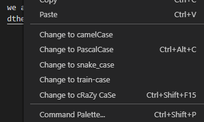

# Welcome To CaseChanger
CaseChanger is a VSCode extension that adds various options for changing the cases of highlighted text. Simply highlight text, and you'll see options in your context menu for a selection of different cases.

There are two shortcuts included in this extension. CTRL + ALT + C (Subject to change) changes the case of selected text to PascalCase, however, there are plans to change it to be:
1. User Editable, workspace specific keybind to a command of your choice.
2. More like a CaseChange keybind that switches between cases

The word detection RegEx does a good job at separating given text into words, however it is not perfect. In addition, we are always looking for new features and coding out nasty bugs, so feel free to contribute @ https://github.com/dthelegend/CaseChanger